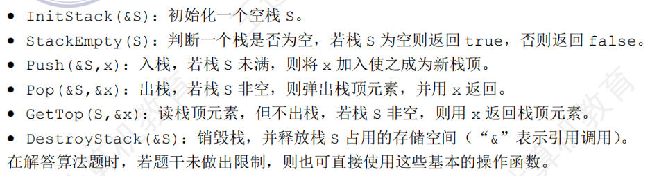
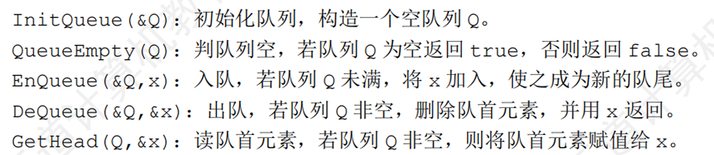

**叠甲：不会涵盖全部知识，只是把一些感觉会考的内容用我自己的话写进去（所以标号也会跟王道的书有出入）。其中内容来自王道参考书**

# 栈、队列和数组

## 1.栈
### 基础知识
- 定义：只允许在一端插入/删除的线性表
- 操作特性：后进先出（LIFO）
- 基本操作：

- 数据结构组成部分：栈顶（`top`）元素和“容器”（一般为数组or链表）
- 栈的分类：顺序栈和链栈，本质是存储结构的不同
- 顺序栈的应用：共享栈——一个数组两个栈共享空间，节省存储空间并且不影响存取效率
> 这一节历年考题都围绕栈的出列和入列序列来考察，只要知道栈FIFO的操作特性，就一定会做
> 另外，栈的FIFO特性也可以用于检查链表是否为中心对称，算法体现在王道课后综合应用题的第4题

### 打卡表内容
- 定义顺序存储的栈（数组实现），数据元素是 int 型
```C
#define MaxSize 50
typedef struct
{
    int data[MaxSize];
    int top;
}ArrayStack;
```
- 基于上述定义，实现“出栈、入栈、判空、判满”四个基本操作
```C
bool Push(ArrayStack &S,int x)//入栈操作
{
    if(S.top == MaxSize -1)
    {
        return false;
    }
    else
    {
        S.top++;
        S.data[S.top] = x;
        return true;
    }
}

bool Pop(ArrayStack &S,int &x)//出栈操作
{
    if(S.top == -1)
    {
        return false;
    }
    else
    {
        x = S.data[S.top];
        S.top--;
        return true;
    }
}

bool Empty(ArrayStack S)//判断栈空操作
{
    if(S.top == -1)
    {
        return true;
    }
    else
        return false;
}

bool Full(ArrayStack S)//判断栈满操作
{
    if(S.top == MaxSize-1)
    {
        return true;
    }
    else
        return false;
}
```
- 定义链式存储的栈（单链表实现）
```C
typedef struct LinkNode{
    int data;
    struct Linknode *next;
}LinkNode,*LinkStack;
```

- 基于上述定义，栈顶在链头，实现“出栈、入栈、判空、判满”四个基本操作
```C
bool Push(LinkStack &S,int x)//入栈操作
{
    LinkNode *n = (LinkNode*)malloc(sizeof(LinkNode));
    if (n == NULL)
    {
        return false;
    }
    n -> data = x;
    n -> next = S -> next;
    S -> next = n;
    return true;
}

bool Pop(LinkStack &S,int &x)//出栈操作
{
    if(S -> next == NULL)
    {
        return false;
    }
    LinkNode *p = S -> next;
    x = p -> data;
    S -> next = p -> next;
    free(p);
    return true;
}

bool Empty(LinkStack S)//判断栈空操作
{
    if(S -> next == NULL)
    {
        return true;
    }
    else
        return false;
}

bool Full(LinkStack S)//判断栈满操作
{
    LinkStack *test = (LinkStack*)malloc(sizeof(LinkStack));
    if(test == NULL)
    {
        return true;
    }
    else
    {
        free(test);
        return false;
    }
        
}

```
- 定义链式存储的栈（双向链表实现）
```C
typedef struct Linknode{
    int data;
    struct Linknode *rear;
    struct Linknode *next;
}Linknode;

typedef struct LinkStack{
    struct LinkNode *head,*rear;
}Linknode,*LinkStack;
```
- 栈顶在链尾，实现“出栈、入栈、判空、判满”四个基本操作
```C
bool Push(LinkStack &S,int x)//入栈操作
{
    LinkStack *n = (LinkStack*)malloc(sizeof(LinkStack));
    if (n == NULL)
    {
        return false;
    }
    n -> data = x;
    n -> rear = S -> rear;
    S -> rear -> next = n;
    n -> next = NULL;
    S -> rear = n;
    return true;
}

bool Pop(LinkStack &S,int &x)//出栈操作
{
    if(S -> head == S -> rear)
    {
        return false;
    }
    LinkNode *p = S -> rear;
    x = p -> data;
    S -> rear = p -> rear;
    S -> rear -> next = NULL;
    free(p);
    return true;
}

bool Empty(LinkStack S)//判断栈空操作
{
    if(S -> head == S -> rear)
    {
        return true;
    }
    else
        return false;
}

bool Full(LinkStack S)//判断栈满操作
{
    LinkNode *test = (LinkStack*)malloc(sizeof(LinkStack));
    if(test == NULL)
    {
        return true;
    }
    else
    {
        free(test);
        return false;
    }     
}

```

## 2.队列
### 基础知识
- 定义：只允许在一端插入，另一端删除的线性表
- 操作特性：先进后出（FIFO）
- 基本操作：

- 数据结构组成部分：队头队尾（`front`和`rear`）元素和“容器”（一般为数组or链表）
- 队列的分类：顺序队列和链式队列，本质是存储结构的不同
- 顺序队列的优化：循环队列——注意队头队尾的初始化和队满队空的判定
- 队列的应用：双端队列——可以两端插入删除，有些情况一端可以插入删除另一端只能插入
> 这一节历年考题主要是围绕双端队列、循环队列和队列的操作特性这三个考点考选择题，大题这几年就考过一次应用题（嗯对是应用题，因为没有涉及到让你设计算法也没有让你写代码）

### 打卡表内容
- 定义顺序存储的队列（数组实现），数据元素是 int 型
```C
#define MaxSize 50
typedef struct
{
    int data[MaxSize];
    int front;
    int rear;
}ArrayQueue;
```

- 基于上述定义，实现“出队、入队、判空、判满”四个基本操作
```C
bool Push(ArrayQueue &Q,int x)//入队操作
{
    if(Q.front == (Q.rear + 1)% MaxSize)
    {
        return false;
    }
    else
    {
        Q.data[Q.rear] = x;
        Q.rear = (Q.rear + 1)% MaxSize;
        return true;
    }
}

bool Pop(ArrayQueue &Q,int &x)//出队操作
{
    if(Q.front == Q.rear)
    {
        return false;
    }
    else
    {
        x = Q.data[Q.front];
        Q.front = (Q.front + 1)% MaxSize;
        return true;
    }
}

bool Empty(ArrayQueue Q)//判断队空操作
{
    if(Q.front == Q.rear)
    {
        return true;
    }
    else
        return false;
}

bool Full(ArrayQueue Q)//判断队满操作
{
    if(Q.front == (Q.rear + 1)% MaxSize)
    {
        return true;
    }
    else
        return false;
}
```
- 定义链式存储的栈（单链表实现）
```C
typedef struct Linknode{
    int data;
    struct Linknode *next;
}LinkNode;

typedef struct{
    LinkNode *front,*rear;
}LinkQueue;
```

- 基于上述定义，实现“出队、入队、判空、判满”四个基本操作
```C
bool Push(LinkQueue &Q,int x)//入队操作
{
    LinkNode *n = (LinkNode*)malloc(sizeof(LinkNode));
    if(n == NULL)
    {
        return false;
    }
    n -> data = x;
    n -> next = NULL;
    Q.rear -> next = n;
    Q.rear = n;
    return true;
}

bool Pop(LinkQueue &Q,int &x)//出队操作
{
    if(Q.front == NULL && Q.rear == NULL)
    {
        return false;
    }
    LinkQueue *p = Q.front;
    x = p -> data;
    Q.front = p -> next;
    if(Q.front == Q.rear)
    {
        Q.rear = NULL;
    }
    free(p);
    return true;
}

bool Empty(LinkQueue Q)//判断队空操作
{
    if(Q.front == NULL && Q.rear == NULL)
    {
        return true;
    }
    else
        return false;
}

bool Full(LinkQueue Q)//判断队满操作
{
    LinkNode *n = (LinkNode*)malloc(sizeof(LinkNode));
    if(test == NULL)
    {
        return true;
    }
    else
    {
        free(test);
        return false;
    }       
}
```

## 3.栈和队列的应用
### 基础知识
- 本质：应用栈的后进先出（LIFO）特性和队列的先进先出特性（FIFO）
- 栈的应用：括号匹配、表达式求值、递归
- 队列的应用：层次遍历、计算机系统（设置缓冲区解决速度不匹配问题，CPU就绪队列）

> 这一节总的来说还是考栈的应用比较多一点，需要注意中缀表达式转后缀表达式的步骤，精确到每一步都得熟悉

## 4.数组和特殊矩阵
### 基础知识
- 数组是一个特殊的线性表
- 二维数组根据保存策略分为按行优先和按列优先
- 特殊矩阵：这些由于一些元素的重复可以被压缩存储，所以也可以叫做压缩矩阵
    - 对称矩阵：下三角与上三角对称
    - 三角矩阵：下三角or上三角存储数据，另外一个三角区内的元素统一为一个常数
    - 三对角矩阵：主对角线和上/下三角的对角线处有数据，其他全为0
    - 稀疏矩阵：矩阵中数据密度低，可以用十字链表or三元组表压缩存储（包含矩阵的行列位置和元素内容）
> 这一节涉及到的考点不算难，主要是三个压缩矩阵中元素的位置与保存在最终数组中位置的关系，以及多维数组的考察等，稀疏矩阵相关考点偏向概念，复习的时候稍微过一下就好。
> 尤其易错的点在于压缩矩阵和多维数组的存储方式：是按行优先还是按列优先？不审题容易错
